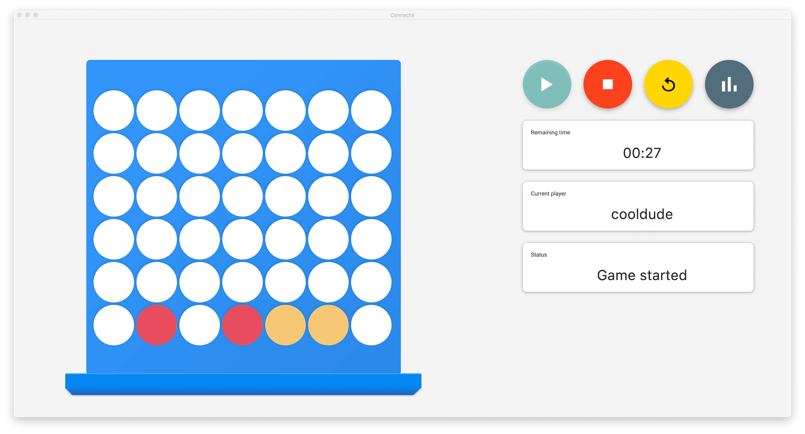
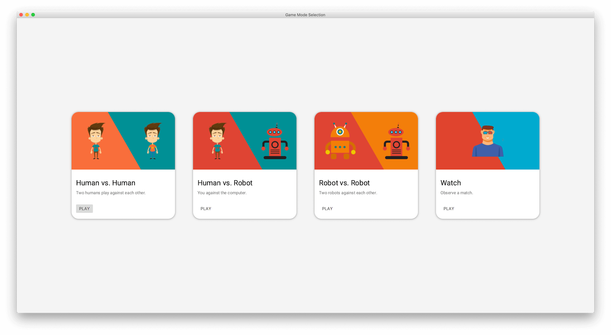
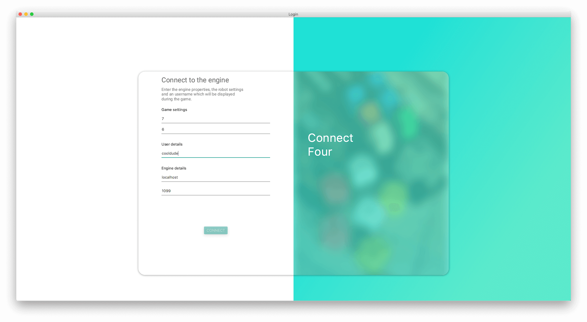

# connect4

A program to play connect four over RMI as part of a homework in SWE4UE SS19 at [FH OÖ Campus Hagenberg](https://www.fh-ooe.at/en/hagenberg-campus).

## ✨ Features

* Player vs. Player
* Player vs. Robot
* Robot vs. Robot
* Watch a game

## 🚧 Possible improvements 

* Use [MiniMax](https://en.wikipedia.org/wiki/Minimax) to make the robot more intelligent
* Add a score board

## 🏗 Frameworks

* [JFoenix](http://www.jfoenix.com/)
* [Afterburner.fx](http://afterburner.adam-bien.com/)

## 👊 Attributions

* Robots by [Vecteezy](https://www.vecteezy.com)

## 📃 License

